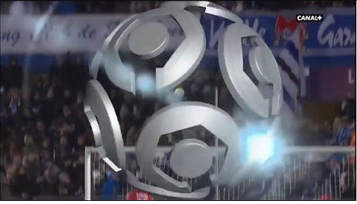
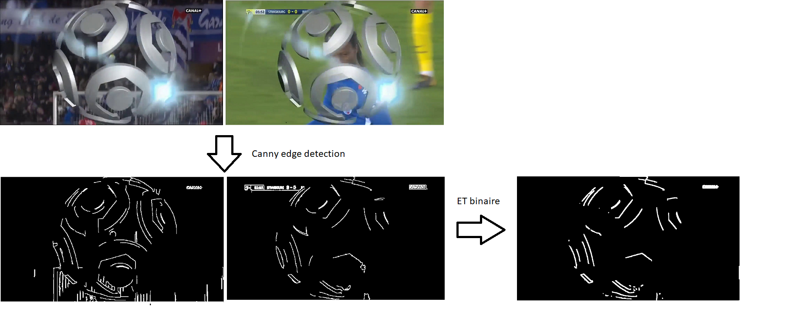

# Replay Detector
This program detects replays in sport games. Typically, replays are introduced by a logo 
(for example the logo of one of the teams) and end with a logo. 
Here is an example of a logo : 

 
 
 ## Why is this useful ?
 Replays are the important moment of the videos, so we can effectively summarize a sport
 video using its replays. 
 
 ## How it works
 Logos are static asset incrusted in the video; and they appear multiple times, 
 so if we compare the contours of two frames containing a logo, those contours should roughly
 be the same.
 
 
 
 Further informations can be found in rapport/summary.pdf (in french).
 
 ## Running the program
 First build the docker image : 
 
 > make build docker
 
 Then run the docker image :
 
 > make run docker
 
 It will starts a server on localhost which accept JSON RPC requests, see example_request.http for an 
 example of request. 
 ## Program input : HTTP requests
 The parameters of the request are :
 - youtubeUrl (required) : the program downloads videos from youtube and uses it as input
 - startFrame : allows skipping the first N frames of the videos, useful because there 
 is usually a lot of noise at the start of a video
 
 ## Program output : 
 The program will create multiple folders; each folders contains frames of a logo.
 
 ## Environment variables
 - MODE: either WEBSERVER, YOUTUBE or VIDEO; if WEBSERVER then starts a web server on localhost at port 
 22022, if YOUTUBE then youtube url in to_parse will serve as input, if VIDEO then videos in the videos folder 
 will be parsed